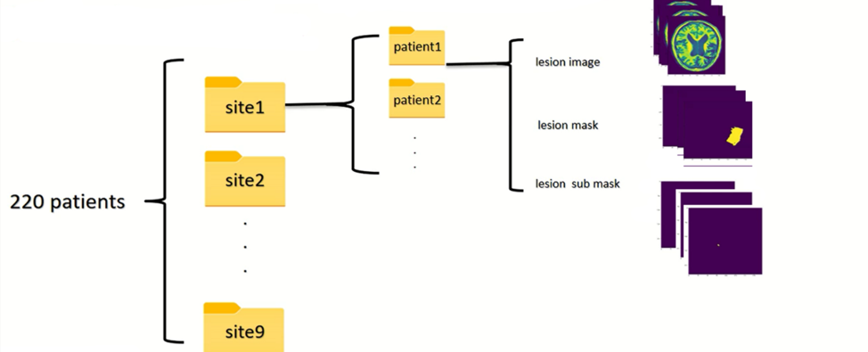
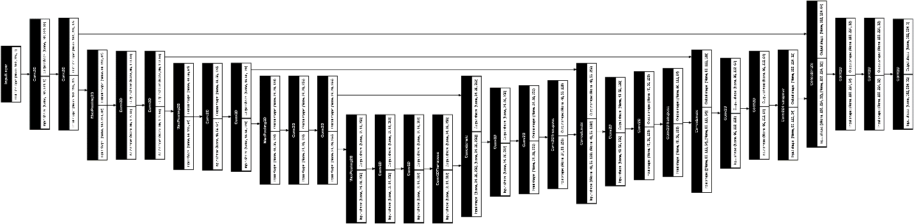
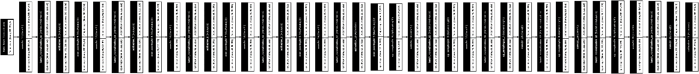
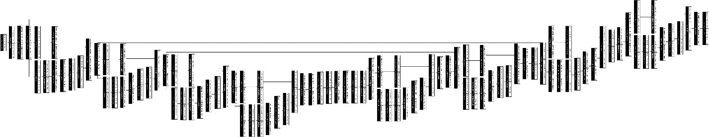
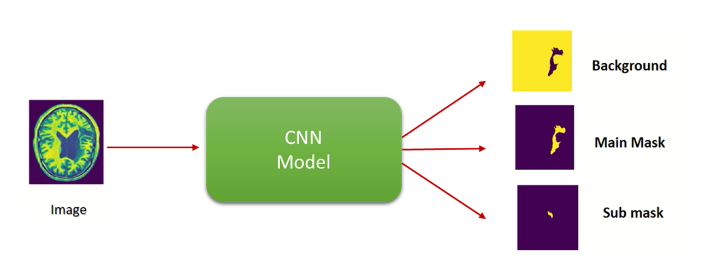
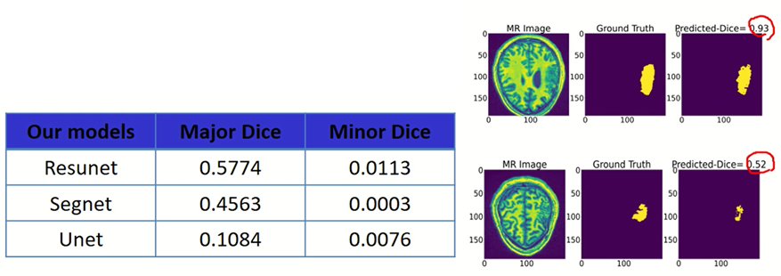
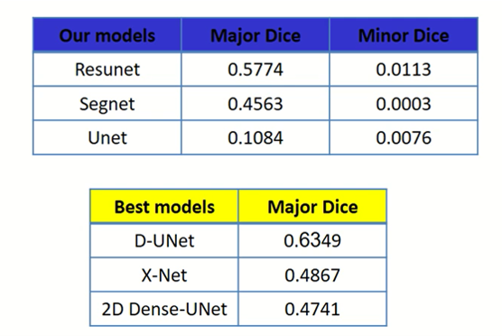

# segmentation of post-stroke lesion area by Deep Learning approaches

---

## Introduction

Stroke is the leading cause of adult disability worldwide, with up to two-thirds of individuals experiencing long-term disabilities. Large-scale neuroimaging studies have shown promise in identifying robust biomarkers (e.g., measures of brain structure) of stroke recovery. However, analyzing large datasets is problematic due to barriers in accurate stroke lesion segmentation. Manually-traced lesions are currently the gold standard for lesion segmentation, but are labor intensive and require anatomical expertise. While algorithms have been developed to automate this process, the results often lack accuracy. Newer algorithms that employ machine-learning techniques are promising, yet these require large training datasets to optimize performance.

---

## Dataset

### Data description

We got ATLAS (Anatomical Tracings of Lesions After Stroke) dataset from Nature site [1,2]. It is an open-source dataset of 220 T1-weighted MRI scans with manually segmented lesions.

1.[https://www.nature.com/articles/sdata201811](https://www.nature.com/articles/sdata201811)

2.Liew, S.-L. et al. A large, open-source dataset of stroke anatomical brain images and manual lesion segmentations. Sci Data 5, 180011 (2018)

The dataset was collected from 9 different sites around the world. As a result, it is organized into 9 main folders, one for each site. Inside each site’s folder, there are multiple subfolders, each corresponding to an individual patient. For each patient, the data includes:

- a T1-weighted MRI scan image
- a main lesion mask
- a submask, which is significantly smaller in size compared to the main mask.

---

## Model Training and Experiments

We trained three different models — ResNet, SegNet, and U-Net — to perform segmentation on the MRI images in this dataset. For each model, we experimented with different loss functions to evaluate which approach yields the best performance.

### Loss Functions:

#### Categorical Cross Entropy Loss (CCE)

Categorical Cross Entropy measures the difference between the predicted probability distribution and the true class labels for multi-class segmentation. It penalizes the model when the predicted probabilities diverge from the one-hot encoded ground truth.

where:

- N is the total number of pixels
- C is the number of output classes
- y_ic is the ground truth label for i-th pixel (0 or 1)
- p_ic is the predicted probability for i-th pixel

---

#### Dice Loss

Dice Loss is derived from the Dice coefficient, which measures the overlap between the predicted mask and the ground truth mask. It is particularly useful for medical image segmentation tasks where the target regions (e.g., lesions) are small compared to the overall image size.

Dice loss = 1 - Dice coefficient

- N is the total number of pixels
- p_i is the value of the i-th pixel in the predicted mask
- g_i is the value of the i-th pixel in the ground truth mask

Higher Dice coefficients indicate better overlap between the predicted and true masks.

---

#### Combined Loss (CCE + Dice Loss)

                  Loss=CCE + Dice Loss

---

## Augmentation

Given that our dataset is relatively small, we also applied various data augmentation techniques to improve the models’ accuracy and generalization. Some of the key augmentation methods we used include:

- random rotations
- horizontal and vertical flips
- scaling and zooming
- elastic deformations
- intensity variations (e.g., brightness and contrast adjustments)

---

## Preprocessing

The values in the ground truth masks were not originally binary (i.e., 0 and 1). Therefore, we processed and saved the masks to ensure they contained only 0 and 1 values.

In addition to the submask, some patients also had an extra, finer mask file. We combined this finer mask with the submask to create a single submask for each patient.

Furthermore, the original MRI scans for each patient were 3D volumes. We converted these 3D images into standardized 2D slices and saved them. After this conversion, we obtained a total of 7,917 2D images from the scans of 220 patients.

---

## Model Architectures Overview

**Library used:** Keras (Python)

---

### ✅ U-Net

U-Net uses skip connections between encoder and decoder layers to preserve spatial details and improve segmentation accuracy.

---

### ✅ SegNet

SegNet encodes the image through pooling and reconstructs it via upsampling, without skip connections, making it simpler and lighter than U-Net.

---

### ✅ ResUNet

ResUNet integrates residual blocks into the U-Net architecture, enabling deeper feature learning while maintaining skip connections for precise segmentation.

---

All models are designed to receive the input image and generate three output channels for segmenting the background, the main mask, and the submask.

---

We trained our models for 100 epochs with a batch size of 32, and the average Dice score on the main mask was as follows.

---

Subsequently, in December 2020, we reviewed and compared the best-performing models available on this dataset at that time.

[https://paperswithcode.com/sota/lesion-segmentation-on-anatomical-tracings-of](https://paperswithcode.com/sota/lesion-segmentation-on-anatomical-tracings-of)
